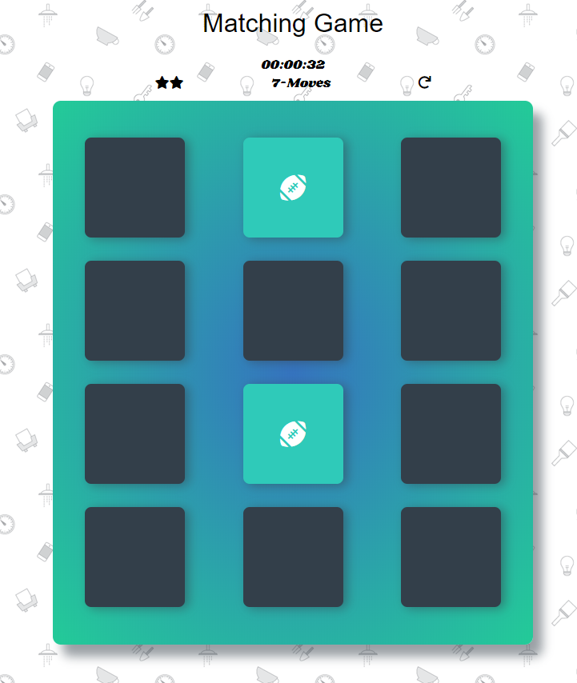

# Memory-game
Final project for Udacity IPND
##how it looks

## Instructions
* pick difficulty
* Each turn reveal 2 cards
* match all cards to get victory screen
* you can restart your game at any time using restart button
## stars
higher difficulty you chose more stars you will start with, every 2 misstakes you will lose 1 star.
try to finish the game with as many stars as possible. 
## How it was made
This game was made using JS with jQuery , manipulating DOM of index HTML file. 
the styling was done in css. 
